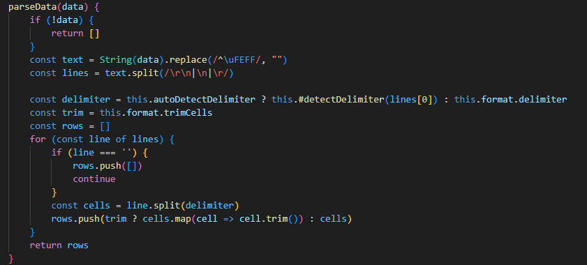
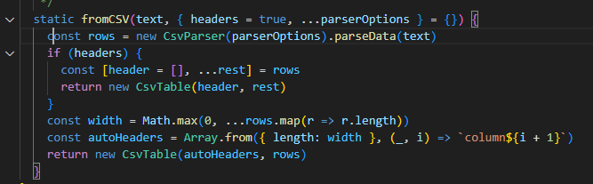
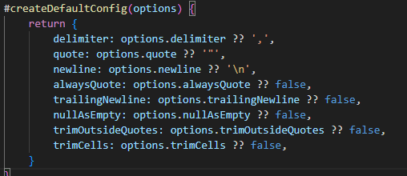
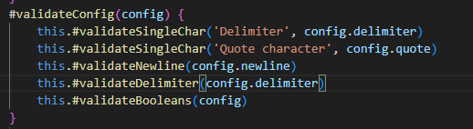

## Reflektion
### Namngivning (kapitel 2)
   | Namn | Förklaring | Reflektion och regler från Clean Code |
|------|------------|---------------------------------------|
|  CsvTable |    Huvudklassnamn för tabellmodulen för csv hanteraren |Use Intention-Revealing Names: Namnet är tänkt att vara direktöverskådligt och tydligt för vad klassen gör. Som regel bör klassnamn vara substantiv och csvTable följer detta.|
| parseData  |  Går igenom datan och returnerar dessa i rader.       | MethodNames: Metoden följer principen i boken om metodnamn med användande av verb, dock kan jag tycka i efterhand att den är lite missvisande då den går mer än bara parsa datan vilket går i konflikt med andra principer i clean code som "Do one thing"|
|  getColumnCount | Hämtar antal kolumner   | Use Intention-Revealing Names: Namnet säger vad metoden gör. Method Names: Verb. Avoid Disinformation: Inget vilseledande. Pronounceable: Lätt att säga och förstå. Metodnamnet är ett bra exempel på Clear Intent. |
| getCellByHeader | Hämtar cellinnehål genom att kombinera rad-index och header-namn istället för numeriska kolumn-index|  Use Intention-Revealing Names: Namnet avslöjar intentionen - man hämtar cell "by header" vilket är tydligt. Method Names: Verb "get" kombinerat med "ByHeader" förklarar exakt vad som returneras och hur. Avoid Disinformation: Ingenting vilseledande. Solution Domain Names: "ByHeader" är en lösning på problemet att användare kanske inte vet kolumn-nummer men vet header-namn. |
| getColumnIndex | Hämtar kolumnindex från tabellen| Add Meaningfull Context: Följer tydligt mönster med getter samt tydligt i namnet column och index vad den hämtar. |

### Reflektion kapitel 2
Min reflektion av kapitel 2 i Clean Code är att boken simplifierar aspekten namngivning och samtidigt framhäver betydelsen av namngivning i kod. Exempelvis att klassnamn bör vara substantiv och metod/funtioner ska vara verb ger en både en generell och bra regel att följa men underlättar också i att abstrahera sin kod och tänk. Exempelvis i denna modul har vi klassen CsvParser som berättar att det är den delen av koden som ansvarar för läsningen av datan. I klassen har vi sen parseData som berättar att det är den metoden som sköter läsningen. Efter att ha läst boken Clean Code tycker jag att jag fått en tydligare bild för hur man lättare kan göra en kod modulär och hur namngivningen direkt underlättar ens egen och andra utvecklares förståelse. 

### Reflektion – Funktioner och metoder (Kapitel 3)

| Metodnamn | Länk eller kod | Antal rader (ej ws) | Reflektion |
|-----------|----------------|---------------------|------------|
| validateTableInput() |  | 13 | Do One Thing: Metoden gör två saker - validerar headers och rows separat, plus länkvalidering mellan dem. Borde eventuellt delas upp. Function Arguments: Två argument är acceptabelt enligt clean code.  Förbättringsförslag: Kunde delas upp i validateHeaders() och validateRowsAgainstHeaders() för bättre fokus. |
| parseData() | | 15 | Gör flera saker - hanterar tom input, tar bort BOM, splitter rader, detekterar delimiter, trimmar celler.  Förbättringsförslag: Kunde extraheras till #formatRows() och #trimIfNeeded().|
| fromCSV()| | 9 | Storlek: 9 Rader är okej längd och den följer Do One Thing principen, skapa en CSV-tabell från CSV text. Arguments:Två argument vilket är acceptabelt enligt clean code. Error Handling: Använder destructuring för att hantera headers-fall enkelt.|
| #createDefaultConfig() |  | 8 | Storlek: 8 Rader är lagom längd. Gör endast en sak, skapar en standard konfiguration. Return Value: Returnerar konfigurationsobjekt. |
| #validateConfig() |  | 5 | Do One Thing: Gör bara en sak - validerar config genom att anropa andra validatorer. Small Functions: 5 rader. Descriptive Names: Metodnamnet säger exakt vad den gör. |

### Reflektion kapitel 3
Även i kapitel tre tycker jag boken ger bra och konkreta regler att förhålla sig gällande funktioner och metoder. I min modul har jag försökt att fokusera på att ha mindre funktioner och vara noga med single responsability principen vilket jag tycker till stor del jag lyckats med dock med några undantag. I det stora hela tycker jag boken förklarar och knyter samman koncepten på ett bra sätt, jag kommer absolut ta med mig principerna som Do One Thing, Function Argument och Small functions då jag upptäckt hur mycket lättare det är att följa sin egen kod och sina egna tankar kring problemlösningen om jag bryter ner ansvare i mindre delar av koden. 

### Reflektion
I den här uppgiften har jag lärt mig flera principer gällande kodkvalitet och fått en djupare förståelse för hur bokens principer faktiskt hjälper en att skriva bra kod. 
De principer från boken jag tycker varit mest värdefulla att använda mig av är Single Responsibility för att hålla koden lättförstålig och mindre netslad, principen Small för att verkligen kunna se fördelarna med att ha korta funktioner och metoder med eget ansvar gör koden lättare att förstå och underhålla. Om jag skulle jämföra längden på mina metoder i denna uppgiften från tidiga commits till sena skulle jag nog säga att min längsta funktion haft över 30 rader kod och gjort upp till 4 saker men efter att ha brutit ned detta med principerna som SRP och One Level of Abstraction per Function är det lätt att dela upp ansvaret till mindre funktioner.
Ett konkret exempel är funktionen parseData i CSVParser klassen där jag fortfarande bryter mot dessa principer och har därför haft svårigheter att testa just den metoden för den anledningen. 
Avslutningsvis så har jag fått med mig många bra verktyg från boken som jag kommer att använda mig av i framtiden. Principer som bra namngivning för att inte behöva onödiga kommentarer i koden och principerna om små och separata ansvar till respektive funktion är något jag kommer ta med mig till nästa uppgift.  