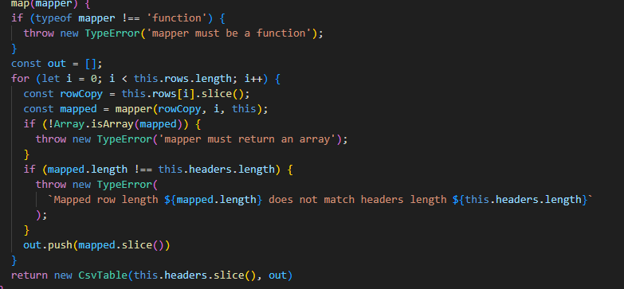
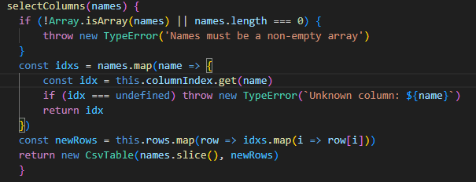

    Tabellreflektion för namnginving
    Kapitelreflektion kap 2
    Tabellreflektion för funktioner/metoder
    Kapitelreflektion kap 3
    Reflektion över egen kodkvalitet

   | Namn | Förklaring | Reflektion och regler från Clean Code |
|------|------------|---------------------------------------|
|  CsvTable |    Huvudklassnamn för tabellmodulen för csv hanteraren |Use Intention-Revealing Names: Namnet är tänkt att vara direktöverskådligt och tydligt för vad klasses syfte är|
| pushField  |         | MethodNames: Metoden följer principen i boken om metodnamn med användande av verb (push) för att tydligt indiker vad metoden för samt Field som anger vad som pushas. Pick One Word  per Concept: push använder känt API uttryck och är därför självförklarande i sitt syfte|
|  handleOutsideQuotes | Hanterar citattecken vid validering       | Method names: Här tycker jag att funktionens namn bryter mot method names syfte att vara tydlig med att verbet "handle" inte tydligt berättar vad funktionen har för syfte |
| isDelimiter | Kontrollerar om ett tecken är ett delningstecken i indatan, exempelvis koma eller semikolon.| Don't be cute: Tydligt bolskt värde på "is" och tydligt vad det kontrollerar i delimeter. Avoid Mental Mapping: Delimiter var ett ord jag inte kände till innan men efter att ha sökt på exempel på liknande program förstått att det är termen som vanligtvis används för den typen av tecken.  |
| getColumnIndex | Hämtar kolumnindex från tabellen| Add Meaningfull Context: Följer tydligt mönster med getter samt tydligt i namnet column och index vad den hämtar. |

# Reflektion – Funktioner och metoder (Kapitel 3)

| Metodnamn | Länk eller kod | Antal rader (ej ws) | Reflektion |
|-----------|----------------|---------------------|------------|
| exempelMetod() | Kod eller GitHub-länk | 12 | Analysera enligt kapitel 3: Gör den bara en sak? Är den för lång? Har den för många argument? Är den lätt att läsa? Föreslå ev. förbättringar. |
| map(mapper) |  | 19 | Funktions Shoudl Do One Thing: Metoden gör i detta fall mer än en sak då den både validerar indata, utdata och mappar den i en ny tabell. Function Argument: Metoden har ett tydligt argument (mapper) Common Monadic Form: I boken beskrivs monadiska funktioner som antingen en fråga som returnerar ett boolean eller transformerar till ett nytt värde. Min funktion map() är av transformations-typ eftersom den returner en ny tabell.|
| selectColumns(names) |  | 11 | ... |
| ... | ... | ... | ... |
| ... | ... | ... | ... |

### Sammanfattande reflektion kapitel 3
Skriv en kort reflektion (ca 1–2 stycken) om vad du lärt dig om funktioner.  
Exempel: Har du behövt bryta ner långa metoder? Har du märkt att vissa funktioner gör mer än en sak? Hur har du tänkt kring antal argument?  

